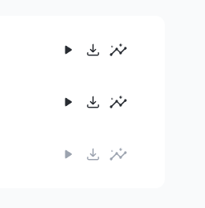
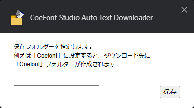

CoeFont Studio Auto Text Downloader
===================================

CoeFont Studio Auto Text Downloader は、CoeFont Studio でセリフ単体を保存しようとしたときに、テキストファイルも一緒に保存するようになる Chrome 拡張です。

注意：このブラウザー拡張は、**画面下部にある波形プレビューの右側にあるダウンロードボタンには反応しません**。入力したセリフの右側にある、以下のようなダウンロードボタンを押したときに自動的に発動します。

- テキストファイルがダウンロードされる
  - セリフの内容が書かれたテキストファイルが自動的にダウンロードされます
- ファイル名が変更される
  - wav ファイルと txt ファイルの名前は自動的に `123455678_キャラ名_セリフ１０文字.wav` のようになります

なおこの Chrome 拡張は、音声保存時にファイル名を変更するため "downloads" 権限を使用しています。

この拡張機能は 2024-12-23 時点のサイトで動作確認しています。  
動かなくなっている場合は Issue か Pull Request をお願いします。  
できれば Pull Request でお願いします。

インストール
------------

このリポジトリーを[ダウンロード](https://github.com/oov/coefont_autotxtdl/archive/refs/heads/main.zip)して解凍して、`パッケージ化されていない拡張機能を読み込む` で読み込んでください。

現時点でストア掲載の予定は特にありません。

オプション設定
--------------

`CoeFont Studio Auto Text Downloader` のオプションを開くと、以下の設定項目があります。

- 保存フォルダー
  - ここでフォルダー名を指定するとダウンロードフォルダー内にフォルダーが作成され、その中に wav ファイルと txt ファイルが保存されるようになります。  
  項目を空欄にするとダウンロードフォルダー直下に保存されます。

Contributors
------------

- mizuna375
  - サイト側の更新によって動かなくなっていたのを修正

- Rintaro1234
  - サイト側の更新によって動かなくなっていたのを修正
  - ダウンロード先フォルダー指定機能の追加
